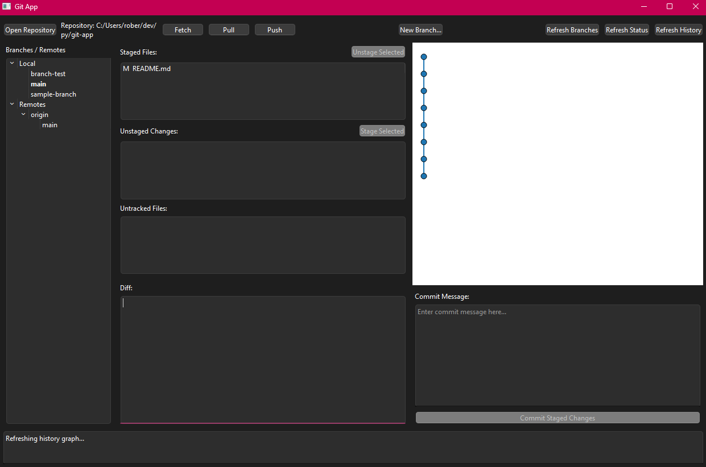

# Git App

## What is it?

A simple GUI app, for git. Provides functionality like staging, and unstaging
files, committing, pushing, pushing, pulling, fetching etc.

Provides visuals, like a commit graph. Branches can be created within the app,
and checked out easily.

## How to use

The same way you would use git, but you just use it through a GUI, rather than
the terminal.
